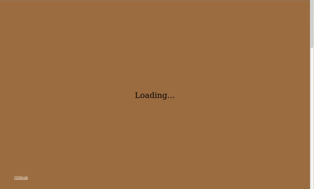

# Spirit Island Web

This is a multiplayer implementation of the board game Spirit Island for the web browser. As it is a coop game all players can control every part of the game - even the hand cards of other players. This implementation dose not enforce the game rules, but only shows the boards, tokens and cards. The players need to enforce the game rules by themselves.

To learn more about Spirit Island look at [Board Game Geeks](https://boardgamegeek.com/boardgame/162886/spirit-island).



[More Screenshots and videos of game play]

See the current state of development in the [Online Version](https://spiritislandweb.herokuapp.com/).

This is an early version of the game, and it is still under development. The raodmap is shown below. The items are implemented in order, and checked when finished. After each heading there will be a new release.

[Link to Subscription List](https://spiritislandweb.hosted.phplist.com/lists/?p=subscribe&id=1)

## Licensing

(Eric: I agree to the terms for creating Spirit Island game elements [set forth in the FAQ](https://querki.net/u/darker/spirit-island-faq/#!.9v5ka4u))

All game assets and texts are owned by Greater Than Games. Other code is licensed under the MIT. This code base is intended for personal and educational use only. I do not intend to use this code commercially - nor do I intend for others to use it commercially - due to the copyrighted elements and the [position of the publisher](https://querki.net/u/darker/spirit-island-faq/#!.9v5ka4u).

## Contributing

This project is huge. I never can build this game alone. So every help is most welcome.

If you have an idea, [tell me](mailto:maddinpsycho@gmail.com?subject=Idea%20for%20SpiritIslandWeb)!

If you see a bug, [report it](https://github.com/maddinpsy/spiritislandweb/issues/new)!

If you want to change something, [change it](https://github.com/maddinpsy/spiritislandweb#development)!

If you like it, [tell your friends](https://spiritislandweb.hosted.phplist.com/lists/?p=subscribe&id=1)!


## Road Map version 0.1

<details>

<summary>Click to expand...</summary>

### Server and multi player

- [x] Set Nickname dialog
- [x] create a new game
- [x] display lobby
  - [x] with link to share 
  - [x] current joined players
  - [x] start button
- [x] join a game by URL
- [x] game play: Display one board for all, no actions (Hello World)

### Design board layout

- [x] 6 base game boards (no thematic)
- [x] ~~zoom and pan the boards, don't sync zoom and pan between clients~~ (not in design phase, breaking dragdrop)
- [x] ~~button to center the view (show all boards)~~ (not in design phase, breaking dragdrop)
- [x] display list with available boards on the left
- [x] drag drop boards and highlight drop spots
- [x] rotate boards with two buttons
- [x] snap to correct position, after rotation
- [x] animate rotation
- [x] synchronize board layout with other players
- [x] animate board move/rotation when updating
- [x] delete board by dropping back into the list ~~(drop spot is highlighted (recycle bin))~~

### Publication

- [x] Bring the game to the cloud as fast as possible. After each improvement there will be an update of the online version.
- [x] Add options to subscribe to updates, users get an email when a new version is available.
- [x] Ask other to help, help is most welcome.

### Add Spirits

- [x] show spirit list on the right, 8 base game spirits
- [x] spirits show as a circular image with fade out border, there name below
- [x] initially no spirits on the boards
- [x] drag drop spirits onto boards
- [x] spirits images are shown in center of the board
- [x] drag drop spirit, when spirit is clicked; drag drop board, when board is clicked
- [x] swap spirits, when drag drop to a board which has already a spirit
- [ ] start game button active, when all boards have a spirits

### Display tokens on board

- [x] Token display in each region
  - [x] all tokens greater than zero displayed as <Icon> x <Number>
  - [x] at least space for 8 tokens with one digit count in each region
  - [x] decrees size of all tokens in one region, if too full
  - [x] don't overlap over region border, even when two digit and lots of tokens 
  - [x] hide when count reaches zero
- [x] Possible tokens
  - [x] Explorer
  - [x] Town
  - [x] City
  - [x] Dahan
  - [x] Blight
  - [ ] Presence for each color
  - [x] Wild
  - [x] Beast
  - [x] Disease
  - [x] Badlands
- [x] User Interaction
  - [x] Every Player can change every region
  - [x] Plus Icon to add new token, shows dialog with all possible tokens
  - [x] small plus/minus icons on each count to increase/decrease number
  - [x] Actions are keep in sync with all players
  - [x] No animation on update

### Display spirit boards

- [x] Display Spirit boards of all chosen spirits
- [x] Possibility to show back site
- [x] possibility to minimize the boards (make it smaller)
- [x] Show Tokens on Presence Track
- ~~[ ] Drag Drop tokens on presence tracks into regions (removes token from track, adds token in region)~~(moved to v0.2)

### Display spirits cards

- [x] show hand cards
- [x] show discarded cards
- [x] reclaim all and reclaim one button
- [x] option to delete a card (forget a power)
- [x] option to choose cards, display chosen cards (for all players)
- [ ] button to end round. All chosen cards will be discarded
- [ ] choose innate powers, show beside of chosen cards, don't discard them
- [x] option to undo play card (take the active card back to hand)

### Draw cards

- [x] random card pile with all power cards from the base game
- [x] option to draw a minor or major
- [x] dialog with four cards
- [x] player chooses one, which is added to his hand
- [x] other three are discarded to discard pile
- [x] option to show discard pile
- [x] reshuffle when empty
- [x] when player forgets a minor/major it is added to the discard pile
- [x] option to claim one card from the discard pile (for some special rules)

### Invader Cards

- [x] display random card pile, face down
- [x] default configuration for cards
- [x] display slots for explore, build, rage
- [ ] display discard pile, face down
- [ ] option to show content of discard pile
- [x] flip top card on click, pile
- [ ] drag drop cards from one slot to the next

### Fear Cards and Terror

- [x] Display random card pile, face down
- [x] option to show content, but face down
- [x] display slot for earned cards
- [x] display slot for discard cards
- [x] option to flip any card, will be shown face up the rest of the game
- [ ] move cards to next slot by drag drop 
- [ ] show current terror level
- [x] Show fear count, just a number
- [x] Small Plus sign to increase number
- [ ] Reset Sign to reset number to zero

### Blight

- [x] Display Blight count
- [x] Small Plus/Minus sign to increase/decrease number
</details>  

## Road Map version 0.2

<details>

<summary>Click to expand...</summary>

### Server and multi player

- [ ] spectate game, when joining after setup phase?!

### Design board layout

- [ ] thematic boards
- [ ] boards from extension (E, F)

### Add Spirits

- [ ] Spirits from all extensions
- [ ] choose which extensions, before game start
- [ ] Options to add custom spirits

### Display tokens on board

- [ ] Explorer + x Strife
- [ ] Town + x Strife
- [ ] City + x Strife
- [ ] transform to basic type, when strife count reaches zero
- [ ] Strife has extra plus/minus signs

### Display spirit boards

- [ ] Spirit Boards from all extensions
- [ ] choose which extensions, before game start
- [ ] Options to add custom boards
- [ ] Drag Drop tokens on presence tracks into regions (removes token from track, adds token in region)

### Draw cards

- [ ] random card pile with all power cards from the base game and extension
- [ ] choose which extensions, before game start

### Invader Cards

- [ ] possibility to display multiply cards in one slot
- [ ] possibility to change structure of deck, before game start

### Fear Cards and Tokens

- [ ] possibility to change structure of deck, before game start
- [ ] fear counter, auto reset and move card when count is <numPlayers>*4

### Blight

- [ ] Auto decrease/increase number when blight is changed in one region

### Events

- [ ] show random deck, face down
- [ ] flip top card on click
- [ ] show discard deck
</details>  


## Development
1. Install Node Version 14.x from [https://nodejs.org/de/download/](https://nodejs.org/de/download/)
2. Install Yarn [https://classic.yarnpkg.com/en/docs/install](https://classic.yarnpkg.com/en/docs/install)
3. Checkout the code:
``` bash
git clone https://github.com/maddinpsy/spiritislandweb.git
```
4. Update dependencies:
``` bash
yarn
```
5. Start the development server
``` bash
yarn start-dev
```
6. edit the code
7. build and deploy
``` bash
yarn build
yarn start
```
